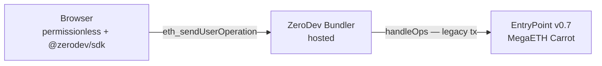

# MegaETH Carrot — AA Infrastructure

Chain ID: 6343 | RPC: https://carrot.megaeth.com/rpc

## EntryPoint

| Version | Address | Status |
|---------|---------|--------|
| v0.7 | `0x0000000071727De22E5E9d8BAf0edAc6f37da032` | ✅ Deployed |
| v0.6 | `0x5FF137D4b0FDCD49DcA30c7CF7f08a6C83Cff3a6` | ❌ Not deployed |

Use EntryPoint v0.7. The `account-abstraction` library is a git submodule under
`packages/contracts/lib/`. Run `git submodule update --init` after cloning, then import:
`account-abstraction/interfaces/IEntryPoint.sol`.

## Bundler

`eth_sendUserOperation` is NOT supported on the MegaETH native RPC.
We use **ZeroDev's hosted bundler** (v3 API), which supports chain 6343.

**Setup:** Create a project at [dashboard.zerodev.app](https://dashboard.zerodev.app),
select "MegaETH Testnet", and copy the bundler URL into `.env`.

```bash
BUNDLER_RPC_URL=https://rpc.zerodev.app/api/v3/{PROJECT_ID}/chain/6343
NEXT_PUBLIC_BUNDLER_RPC_URL=https://rpc.zerodev.app/api/v3/{PROJECT_ID}/chain/6343
```

No local bundler process required. `pnpm dev` is enough.

### Frontend stack (no backend involvement)



**The Rust indexer is read-only** — prices, positions, on-chain events only.
Transactions go directly from the browser to the ZeroDev bundler.

**Required packages:**
```bash
pnpm add @zerodev/sdk @zerodev/passkey-validator permissionless viem tslib
```

## RIP-7212 (P256 Precompile)

The P256 precompile at `0x0000000000000000000000000000000000000100` is **NOT deployed** on Carrot.

Impact: Passkey (WebAuthn) signature verification costs ~200k gas (software P256.sol) instead of ~3.5k gas.
This is acceptable for testnet; re-evaluate for mainnet.

Session keys use ECDSA (secp256k1) which is unaffected by this.

## EIP-7966 (eth_sendRawTransactionSync)

Not supported on Carrot. Use standard `eth_sendRawTransaction` (async).

Frontend must poll for transaction receipts or use the bundler's `eth_getUserOperationReceipt`.

## Contract Addresses

Full artifact: [`packages/contracts/deployments/6343.json`](../packages/contracts/deployments/6343.json)

### AA Infrastructure

| Contract | Address |
|----------|---------|
| EntryPoint v0.7 | `0x0000000071727De22E5E9d8BAf0edAc6f37da032` |
| SessionKeyValidator | `0x672B55126649951AfbbD13d82015691BC8BAD007` |
| VerifyingPaymaster | `0xbcB4B1FdEC3958BEAc5542B4752f7FAf4BcaF226` |

### Core Protocol

| Contract | Address |
|----------|---------|
| PerpEngine | `0xe35486669A5D905CF18D4af477Aaac08dF93Eab0` |
| Settlement | `0x24354D1022E13f39f330Bbf2210edEEd21422eD5` |
| PriceOracle | `0x7FBe2a83113A6374964d6fe25C000402471079d4` |
| MockUSDC | `0xBD2e92B39081A9Dc541A776b5D7B7e0051851CCB` |
| MockPriceFeed | `0xd152AaBf6e4dA27004dC4a4B29da4a7754318469` |

---

## Trading Flow (end-to-end)

Full flow from grid tap to confirmed on-chain position — zero wallet popups after the initial session key delegation.

```
User taps grid cell
    │
    ▼
lib/trading/submit.ts — openTrade({ isLong, collateral, leverage, accountAddress })
    │
    ├─ 1. getCurrentPriceBounds() — reads PriceOracle.getPrice()
    │       builds: { expectedPrice, maxDeviation: 2%, deadline: now+60s }
    │
    ├─ 2. encodeFunctionData(perpEngineAbi, "openPosition", [...])
    │
    ├─ 3. buildKernelCallData(PerpEngine, innerCallData)
    │       → Kernel execute(mode=0x00, encodePacked(target, 0, data))
    │
    ├─ 4. buildUserOp(smartAccountAddress, kernelCallData)
    │       → nonce key = BigInt(SessionKeyValidator) → routes to our validator
    │       → paymaster = VerifyingPaymaster (sponsors gas)
    │
    ├─ 5. signUserOp(userOp, session)
    │       → concat([sessionKeyAddress (20 bytes), ecdsaSign(userOpHash) (65 bytes)])
    │       → NO wallet popup
    │
    └─ 6. submitUserOp(signedOp)
            → eth_sendUserOperation → ZeroDev bundler → EntryPoint v0.7 → MegaETH
```

### PriceBounds struct

```solidity
struct PriceBounds {
    uint256 expectedPrice;  // from PriceOracle.getPrice()
    uint256 maxDeviation;   // 2% of expectedPrice (200 BPS)
    uint256 deadline;       // block.timestamp + 60s
}
```

### Contract constants

| Constant | Value | Notes |
|----------|-------|-------|
| `MIN_COLLATERAL` | `1e6` | 1 USDC minimum per position |
| `MAX_LEVERAGE` | `100` | Absolute cap |
| `MAX_SAFE_LEVERAGE` | `20` | Safe cap (not immediately liquidatable) |

### Session key prerequisites

Before any trade, the smart account must have:
1. Approved PerpEngine to spend USDC (`ERC20.approve(PerpEngine, amount)`)
2. Granted a session key via `SessionKeyValidator.grantSession(...)` (done by `DelegateModal`)
